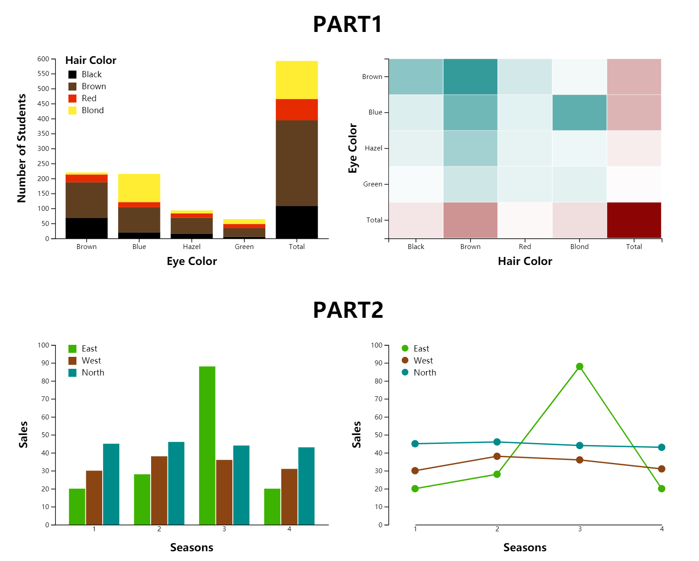
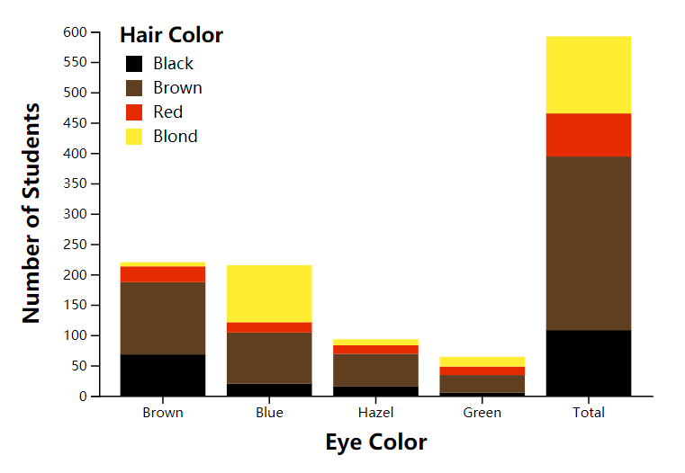
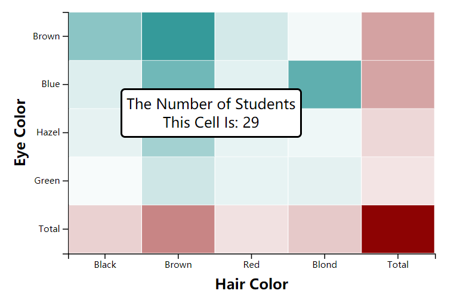
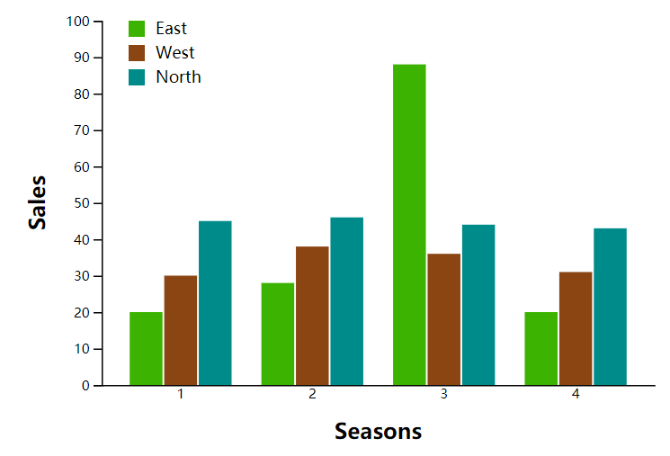
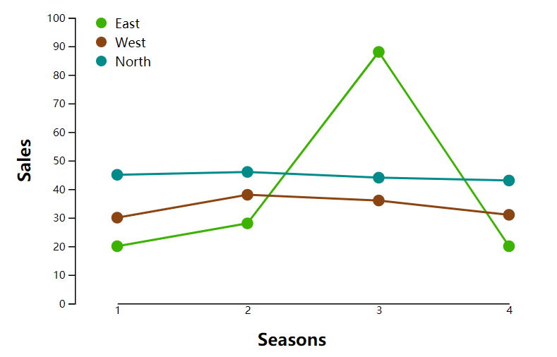

<h1 align="center">LAB 1</h1>

# Result Overview

</img>

# Part 1
## Ⅰ 数据
|EyeColor|Black|Brown|Red Blond|Total|
|:--:|:--:|:--:|:--:|:--:|
|Brown|68|119|26|7|220|
|Blue|20|84|17|94|215|
|Hazel|15|54|14|10|93|
|Green|5|29|14|16|64|
|Total|108|286|71|127|592|

## Ⅱ 可视化思路
数据特征：
1. 数据表达了各种`Hair Color`和`Eye Color`的学生组合数量
2. `Hair Color`和`Eye Color`均涉及4种颜色，并表示了学生总量`Total`
3. 所有值均介于区间`[0, 600]`

基于上述数据特征，考虑以下两种可视化方式：

1. Stacked Bar Chart

    将`Hair Color`堆叠起来，用颜色加以区分。图表展示了各种`Eye Color`的学生数量，也展示了每种`Eye Color`的各个`Hair Color`占比情况和数量情况。
2. Heatmap with Tooltip
    
    由于原数据类别较少，为更方便、直观的观察各种组合的数量，在保持原数据表格形式不变的情况，用颜色深浅加以区分。同时，配合`Tooltip`的交互，提供更为方便的可视化方式。

## Ⅲ 可视化效果
### Stacked Bar Chart 
`stacked bar`中的各个颜色即代表`Hair Color`

</img>

### Heatmap with Tooltip 
红色表示`Total`行、列的数量情况，蓝色表示具体颜色组合数量

</img>

## Ⅳ 技术实现
### Stacked Bar Chart 主要步骤
1. 将原数据按`Hair Color`堆叠起来
```javascript
// stack
    var keys = data.columns.slice(1,-1);  // Hair Color
    var stack = d3.stack().keys(keys);
    var series = stack(data);
```
2. 设置坐标系
```javascript
// coordinates
    var x = d3.scaleBand().range([0, width]).padding([0.2]);
    var y = d3.scaleLinear().range([height, 0]).domain([0,600]);
    x.domain(data.map(function(d) { return d.EyeColor; }));
```
3. 画堆叠出的矩形图
```javascript
// draw rects
    svg
        .append("g")
        .selectAll("g")
        // enter: loog the groups
        .data(series)
        .enter()
        // prepare hair color for the new rectangle(second enter)
        .append("g")
          .attr("fill", function(d,i) { return colors[i]; })
        .selectAll("rect")
        // enter a second time: loop the subgroups
        .data(function(d) { return d; })
        .enter()
        .append("rect")
          .attr("x", function(d) { return x(d.data.EyeColor); })
          .attr("y", function(d) { return y(d[1]); })
          .attr("height", function(d) { return y(d[0]) - y(d[1]); })
          .attr("width", x.bandwidth());
```

### Heatmap with Tooltip 主要步骤
1. 设置坐标系
```javascript
// Build X scales and axis:
    var x = d3.scaleBand().range([ 0, width ]).domain(cols).padding(0.01);
    var y = d3.scaleBand().range([ height, 0 ]).domain(rows).padding(0.01);
```
2. 设置颜色范围
```javascript
// Build color scale
    var myColor_seg = d3.scaleLinear().range(["white", "#008080"]).domain([0,150]);  // blue
    var color_tot = d3.scaleLinear().range(["white", "#8B0000"]).domain([0,600]);  // red
```
3. 重构数据形式
```javascript
// preprocess
    var hairs = ["Black", "Brown", "Red", "Blond", "Total"];
    var heat_vals = [];
    for(var i=0; i<5; i++){
        for(var j=0; j<5 ;j++){
            var valkey = hairs[j];
            var tmp = {
                    "EyeColor": data[i].EyeColor, 
                    "HairColor": valkey,
                    "value": data[i][valkey]
            };
            heat_vals.push(tmp);
        }
    }
```
4. 准备`tooltip`形式及鼠标交互操作
```javascript
// create a tooltip
    var tooltip = d3.select("#g1")
        .append("div")
        .style("opacity", 0)
        .attr("class", "tooltip")
        .style("background-color", "white")
        .style("border", "solid")
        .style("border-width", "2px")
        .style("border-radius", "5px")
        .style("padding", "5px")
        .style("position", "absolute");
// Three function that change the tooltip when user hover / move / leave a cell
    var mouseover = function(d) {
        tooltip.style("opacity", 1)
    }
    var mousemove = function(d) {
        tooltip
          .html("The Number of Students<br>This Cell Is: " + d.value)
          .style("left", (d3.mouse(this)[0]+620) + "px")
          .style("top", (d3.mouse(this)[1]) + "px")
    }
    var mouseleave = function(d) {
        tooltip.style("opacity", 0)
    }
```
5. 添加渐变颜色矩形
```javascript
// add rects
    svg.selectAll()
      .data(heat_vals)
      .enter()
      .append("rect")
      .attr("x", function(d) { return x(d.HairColor) })
      .attr("y", function(d) { return y(d.EyeColor) })
      .attr("width", x.bandwidth() )
      .attr("height", y.bandwidth() )
      .style("fill", function(d) { 
        if(d.EyeColor!="Total" && d.HairColor!="Total")
            return myColor_seg(d.value);  // blue
        return color_tot(d.value)};  // red
      )
      .on("mouseover", mouseover)
      .on("mousemove", mousemove)
      .on("mouseleave", mouseleave);
```

# Part 2
## Ⅰ 数据
|Region|Quarter|Sales|
|:--:|:--:|:--:|
|East|1|20|
|East|2|28|
|East|3|88|
|East|4|20|
|West|1|30|
|West|2|38|
|West|3|36|
|West|4|31|
|North|1|45|
|North|2|46|
|North|3|44|
|North|4|43|

## Ⅱ 可视化思路
数据特征：
1. 共有2个类别型数据，`Region`和`Quarter`
2. 需要表达的数量特征是`Sales`的大小

根据上述数据特征，考虑以下两种可视化方式：
1. Clustered Bar Chart
    若按季度分组，使用分组的`bar chart`展示各个区域`Sales`信息，并用颜色加以区分不同的区域，能直观的表现出每个季度不同区域的销量数量情况。
2. Line Chart
    每条`line`代表一个区域，能直观的表现各个季度的销量情况和变化情况，也能很好的对比不同区域的情况。

## Ⅲ 可视化效果
### Clustered Bar Chart
具体颜色的代表区域见图例

</img>

### Line Chart
具体颜色的代表区域见图例

</img>

## Ⅳ 技术实现
### Clustered Bar Chart
1. 预处理数据
```javascript
// preprocess the data
    var groups = ["1", "2", "3", "4"];
    var subgroup = ["East", "West", "North"];
    var pdata = [];
    for(var i=0; i<4; i++) {
        //
        var tmp = {
            "Quarter": groups[i],
            "East": data[i].Sales,
            "West": data[i+4].Sales,
            "North": data[i+8].Sales
        };
        pdata.push(tmp);
    }
```
2. 设置坐标系
```javascript
// add axis
    var x = d3.scaleBand().domain(groups).range([0, width]).padding([0.2]);
    var y = d3.scaleLinear().domain([0,100]).range([height,0]);
// add subgroup axis
    var xSub = d3.scaleBand().domain(subgroup).range([0, x.bandwidth()]).padding([0.05]);
```
3. 绘制`clustered bar chart`的矩形
```javascript
// show the bars
    svg.append("g")
        .selectAll("g")
        .data(pdata)
        .enter()
        .append("g")
        .attr("transform", function(d) { return "translate(" + x(d.Quarter) + "0)"; })
        .selectAll("rect")
        // enter a second time: loop the subgroup
        .data(function(d) { return subgroup.map(function(key) { 
            return {key: key, value: d[key]}; 
        }); })
        .enter().append("rect")
            .attr("x", function(d) { return xSub(d.key); })
            .attr("y", function(d) { return y(d.value); })
            .attr("width", xSub.bandwidth())
            .attr("height", function(d) { return height - y(d.value); })
            .attr("fill", function(d) { return color(d.key); });
```

### Line Chart
1. 设置坐标系
```javascript
// Add X axis
    var x = d3.scaleLinear().domain([1,4]).rangeRound([40,width]);
    var y = d3.scaleLinear().domain([0, 100]).range([ height, 0]);
```
2. 绘制3条`line chart`
```javascript
// Add the lines
    for(var i=0, cnt=0; i<3; i++, cnt+=4){
        svg.append("path")
          .datum(data.slice(cnt,cnt+4))
          .attr("fill", "none")
          .attr("stroke", colors[i])
          .attr("stroke-width", 2)
          .attr("d", d3.line()
            .x(function(d) { return x(d.Quarter) })
            .y(function(d) { return y(d.Sales) })
        );
    }
```
3. 绘制线上的点
```javascript
// Data dots
    svg.selectAll("circle")
        .data(data)
        .enter().append("circle")
        .attr("stroke", function(d,i){
            var idx = parseInt(i/4);
            console.log(colors[idx]);
            console.log(idx);
            return colors[idx];
        })
        .attr("fill", function(d,i){
            var idx = parseInt(i/4);
            console.log(colors[idx]);
            console.log(idx);
            return colors[idx];
        })
        .attr("r", 5)
        .attr("cx", function(d) { return x(d.Quarter); })
        .attr("cy", function(d) { return y(d.Sales); });
```

# 总结与思考
通过这次实验，我学会了用`d3.js`的基本使用方法，以及绘制`stacked bar chart`、`heatmap`、`clustered bar chart`、`line chart`的思路和具体方案。此次实验也让我理解到，一组相同的数据有不止一种可视化方案，且每种方案各有利弊:
1. `stacked bar chart`能看出量的大小和占比情况，`heatmap`能直观表示每种组合的数量细节
2. `clustered bar chart`能分组展示数量的大小，`line chart`能看出变化趋势

根据实际需求选择合适的可视化方案才是核心。
