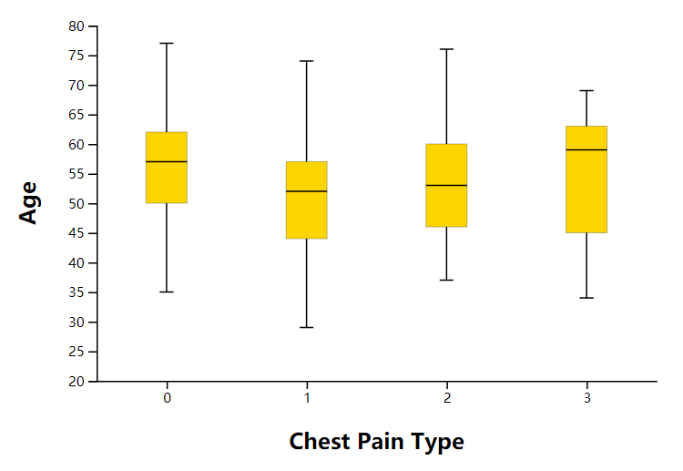

<h1 align="center">LAB 2</h1>

# Result Overview

</img>

# Data
数据源：[kaggle/heart-disease-uci](https://www.kaggle.com/ronitf/heart-disease-uci)

数据说明：
>1. age
>2. sex
>3. chest pain type (4 values)
>4. resting blood pressure
>5. serum cholestoral in mg/dl
>6. fasting blood sugar > 120 mg/dl
>7. resting electrocardiographic results (values 0,1,2)
>8. maximum heart rate achieved
>9. exercise induced angina
>10. oldpeak = ST depression induced by exercise relative to rest
>11. the slope of the peak exercise ST segment
>12. number of major vessels (0-3) colored by flourosopy
>13. thal: 3 = normal; 6 = fixed defect; 7 = reversable defect

在本实验中，仅使用`age`和`chest pain type`特征，分别用`boxplot`和`histogram`绘制每种`chest pain type`的`age`分布情况。

# Boxplot
## Ⅰ 可视化思路
在展示每种`chest pain type`的`age`分布情况时，需要计算的值如下：
>1. min --最小值
>2. q1 --1/4分位点的值
>3. mid --1/2分位点的值
>4. q3 --3/4分位点的值
>5. max --最大值

其中`[q1, q3]`部分用矩形展示，其余均用线段展示。在绘制`boxplot`的过程中，按顺序分别绘制各个部分。

## Ⅱ 可视化效果

</img>

## Ⅲ 技术实现
1. 分离出每种`type`的`age`
```javascript
// preprocess
    var type=[ [], [], [], [] ];
    for(var i=0; i<data.length; i++){
        if(data[i]["type"]==0) type[0].push(data[i]["age"]);
        else if(data[i]["type"]==1) type[1].push(data[i]["age"]);
        else if(data[i]["type"]==2) type[2].push(data[i]["age"]);
        else type[3].push(data[i]["age"]);
    }
    var cmp = function(aa,bb){return (aa-bb);};
```
2. 计算各种类型年龄`min, q1, q2, q3, max`的值
```javascript
// boxplot data
    var dta_box = [ [], [], [], [] ];
    for(var i=0; i<4; i++){
        var t = type[i].sort(cmp);
        var len = t.length;
        var p = [0, 0.25, 0.5, 0.75, 1];
        p.forEach(d => dta_box[i].push(t[Math.max(parseInt(d*len-1), 0)]));
        
    }
```
3. 设置坐标系
```javascript
// coordinates
    var x = d3.scaleBand().range([0,width]).domain([0,1,2,3])
        .paddingInner(1).paddingOuter(.5);
    var y = d3.scaleLinear().range([height,0]).domain([20, 80]);
```
4. 添加`[min, max]`的竖线
```javascript
// vertical lines
    svg.selectAll("vertLines")
        .data(dta_box)
        .enter()
        .append("line")
        .attr("x1", function(d,i) { return x(i); })
        .attr("y1", function(d,i) { return y(d[0]); })
        .attr("x2", function(d,i) { return x(i); })
        .attr("y2", function(d,i){ return y(d[4]); })
        .attr("stroke", "black")
        .style("width", 40);
```
5. 添加`[q1, q3]`的矩形
```javascript
// rectangle
    svg.selectAll("boxes")
        .data(dta_box)
        .enter()
        .append("rect")
        .attr("x", function(d,i) { return x(i)-15; })
        .attr("y", function(d,i) { return y(d[3]); })
        .attr("width", 30)
        .attr("height", function(d,i) { return y(d[1])-y(d[3]); })
        .attr("stroke", "black")
        .attr("stroke-width", "0.1")
        .style("fill", "#ffd500");
```
6. 添加`q2(middle)`的横线
```javascript
// mid horizontal lines
    svg.selectAll("hrznLines")
        .data(dta_box)
        .enter()
        .append("line")
        .attr("x1", function(d,i) { return x(i)-15; })
        .attr("y1", function(d,i) { return y(d[2]); })
        .attr("x2", function(d,i) { return x(i)+15; })
        .attr("y2", function(d,i){ return y(d[2]); })
        .attr("stroke", "black")
        .style("width", 40);
```
7. 添加`max`的横线
```javascript
// up horizontal lines
    svg.selectAll("hrznLines")
        .data(dta_box)
        .enter()
        .append("line")
        .attr("x1", function(d,i) { return x(i)-5; })
        .attr("y1", function(d,i) { return y(d[4]); })
        .attr("x2", function(d,i) { return x(i)+5; })
        .attr("y2", function(d,i){ return y(d[4]); })
        .attr("stroke", "black")
        .style("width", 40);
```
8. 添加`min`的横线
```javascript
// down horizontal lines
    svg.selectAll("hrznLines")
        .data(dta_box)
        .enter()
        .append("line")
        .attr("x1", function(d,i) { return x(i)-5; })
        .attr("y1", function(d,i) { return y(d[0]); })
        .attr("x2", function(d,i) { return x(i)+5; })
        .attr("y2", function(d,i){ return y(d[0]); })
        .attr("stroke", "black")
        .style("width", 40);
```

# Histogram
## Ⅰ 可视化思路
为对应同组数据，使用上述方式绘制的`boxplot`，现分别绘制各`chest pain type`的`age`分布的`histogram`，其中矩形是连续的，详细过程见技术实现部分。

## Ⅱ 可视化效果

</img>

## Ⅲ 技术实现
1. 共需绘制4幅图，使用循环创建`svg`并单独绘制
```javascript
function draw_histogram(data, margin, width, height){
    for(var i=0; i<4; i++){
        var type = [];
        data.forEach(function(d){
            if(d["type"]==i) type.push(d);
        });

        var svg = d3.select("#histogram")
            .append("svg")
            .attr("width", width + margin.left + margin.right)
            .attr("height", height + margin.top + margin.bottom + 40)
            .append("g")
            .attr("transform", "translate(" + margin.left + ", " + margin.top + ")");
        // draw
        histEach(type, svg, margin, width, height);
    }
}
```
2. 设置坐标轴，和histogram的参数，并将数据
```javascript
// add axis
    var x = d3.scaleLinear().range([0, width]).domain([25,80]);
    // histogram parameters
    var hist = d3.histogram()
            .value(function(d){ return d.age; })
            .domain(x.domain())
            .thresholds(x.ticks(11));  // divide into 11 parts
// fit to the histogram
    var bins = hist(data);
    var y = d3.scaleLinear().range([height, 0])
        .domain([0, d3.max(bins, function(d){ return d.length; })]);
```
3. 绘制`histogram`的连续矩形
```javascript
// draw rectangles
    svg.selectAll("rect")
        .data(bins)
        .enter()
        .append("rect")
        .attr("x", 1)
        .attr("transform", function(d){ return "translate(" + x(d.x0) + "," + y(d.length) + ")"; })
        .attr("width", function(d){ return x(d.x1) - x(d.x0); })
        .attr("height", function(d){ return height-y(d.length); })
        .style("fill", "#8cffee")
        .attr("stroke", "black");
```

# 总结与思考
通过本次实验，我学会了使用`d3.js`绘制`boxplot`和`histogram`的方法，并且在寻找适合用这两种图绘制的数据的过程中，我更清楚地明白了它们各自的特点和适合的数据类型：
1. boxplot
    - 特点: In descriptive statistics, a box plot or boxplot is a method for graphically depicting groups of numerical data through their quartiles.
    - 适用的数据类型: groups of numerical data
2. histogram
    - 特点: A histogram is an approximate representation of the distribution of numerical data.
    - 适用的数据类型: numerical data

综上所述，`boxplot`和`histogram`均为`descriptive statistics`中，描述数值型数据分布情况的图表。