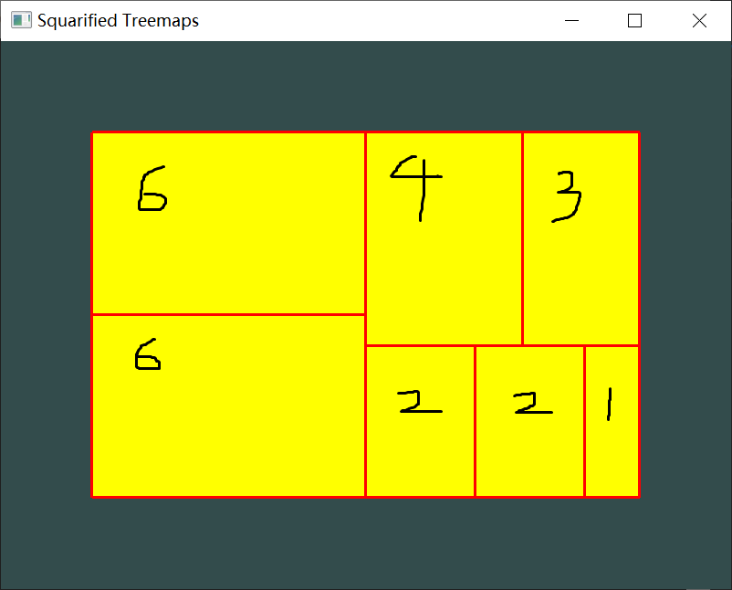
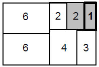
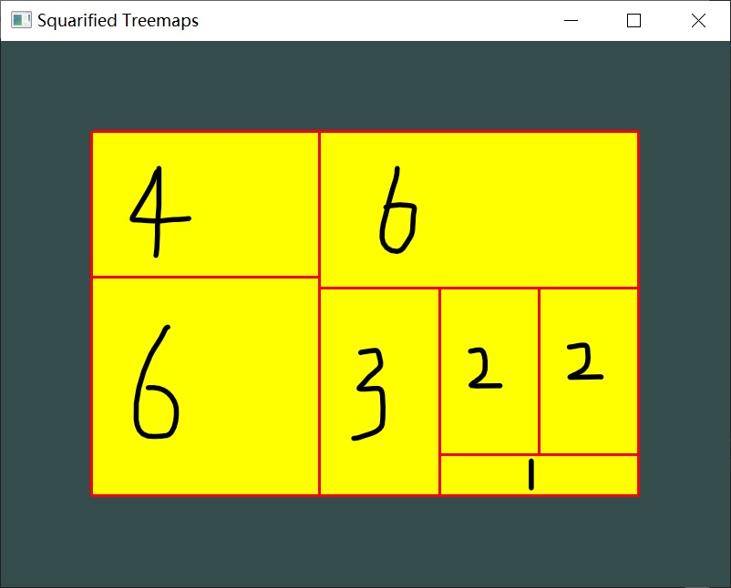
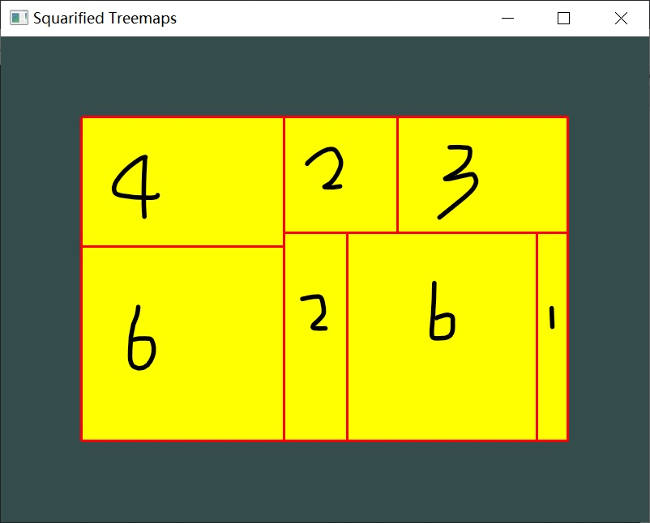

# Squarified Treemaps
本次实验复现了论文`Squarified Treemaps`的算法，将层次结构可视化为宽高比适宜的矩形划分图

源代码(source code)：stm.cpp

## 实验环境
- windows10
- visual studio 2017
- opengl: GLFW
- c++

## 可视化效果
### 使用论文中的测试数据
测试数据同论文Squarified Treemaps中样例（按100的比例扩大），结果标注面积如图所示（由于本次实现坐标从左上角开始计算，因此行`4 3`和行`2 2 1`位置不同，但没有任何影响)
- 数据：`vector<double> areas = { 60000,60000,40000,30000,20000,20000,10000 };`
- 空间尺寸：`WIDTH = 600, HEIGHT = 400`

<div>
<div align="center" style="display:inline-block;">
    <div></div>
    <div><p>实现效果</p></div>
</div>

<div align="center" style="display:inline-block;">
    <div></div>
    <div><p>论文原图</p></div>
</div>
</div>

### 交换测试数据顺序进行测试
为验证矩形面积顺序对可视化效果的影响，将上述测试数据顺序进行调整并查看效果
- 数据：`{ 4,6,6,3,2,2,1 };`
    
    

- 数据：`{ 4,6,2,3,2,6,1 };`
    
    

## 可视化思路
### 图像的绘制
在算法`layoutrow()`时存下当前行矩形的信息，包括4个坐标点，在GLFW的主循环中使用`display`展示所有的矩形

### 算法涉及的函数原型及数据结构
#### 函数原型
- `void squarify(vector<double> children, vector<double> row, double w);`
    + `children` 为还需要安置的矩形面积
    + `row`为当前行已安置的矩形面积
    + `w`为当前正在安置位置的大矩形的宽（短边长）
- `double worst(vector<double> R, double w);`
    + 返回值：当前矩形的最差长宽比（与1之差绝对值的最大值）
    + `R`为矩形面积列表
    + `w`为当前正在安置位置的大矩形的宽（短边长）
- `void layoutrow(vector<double> R, double w);`
    + `R`为矩形面积列表
    + `w`为当前正在安置位置的大矩形的宽（短边长）
- `double width(vector<double> R, int w);`
    + 返回值：当前空余面积的短边，使用全局变量`Rwidth`和`Rheight`存储空余矩形信息，返回二者之间的最小值
    + `R`为矩形面积列表
    + `w`为当前正在安置位置的大矩形的宽（短边长）

#### 数据结构
- 矩形：存放4个顶点坐标
```c++
struct Rectangle {
    double x1, y1, x2, y2, x3, y3, x4, y4;
};
```

## 技术实现
### squarify
```c++
void squarify(vector<double> children, vector<double> row, double w) {
    if (w <= 0) return;
    if (children.empty()) {
        if(!row.empty()) layoutrow(row, w);  // output current row
        return;
    }
    // 
    double c = children[0];
    vector<double> newrow = row;  // newrow
    newrow.push_back(c);

    if (worst(row, w) >= worst(newrow, w)) {  // can be placed in this row
        //cout << " add: " << c << endl;
        vector<double> tmp(children.begin() + 1, children.end());
        squarify(tmp, newrow, w);
    }
    else {  // placed in a empty new row
        layoutrow(row, w);  // output current row
        squarify(children, {}, width(row, w));
    }
}
```

### worst
```c++
double worst(vector<double> R, double w) {
    if (R.empty()) return INF;
    double rmx = 0, rmn = INF, s = 0;
    for (auto r : R) {
        s += r;
        if (r > rmx) rmx = r;
        if (r < rmn) rmn = r;
    }
    double pw = pow(w, 2), sw = pow(s, 2);
    double res = max(pw*rmx / sw, sw / (pw*rmn));
    return max(pw*rmx / sw, sw / (pw*rmn));
}
```

### layoutrow
```c++
void layoutrow(vector<double> R, double w) {
    double lx = WIDTH - Rwidth + (_WIDTH-WIDTH)/2., 
        ly = HEIGHT - Rheight + (_HEIGHT - HEIGHT) / 2.;  // left-top
    
    int direction;  // 0: horizontal;  1: vertical

    // refresh Rwidth, Rheight
    double sum = 0;
    for (auto r : R)
        sum += r;
    double ext = sum / w;
    if (abs(w - Rwidth) <= 1e-6) {
        Rheight -= ext;
        direction = 0;
    }
    else {
        Rwidth -= ext;
        direction = 1;
    }

    // store
    for (auto r : R) {
        if (direction == 0) {
            double hh = ext, ww = r / ext;
            rects.emplace_back(
                transx(lx), transy(ly),
                transx(lx+ww), transy(ly),
                transx(lx+ww), transy(ly+hh),
                transx(lx), transy(ly+hh)
            );
            // refresh
            lx += ww;
        }
        else {
            double ww = ext, hh = r / ext;
            rects.emplace_back(
                transx(lx), transy(ly),
                transx(lx + ww), transy(ly),
                transx(lx + ww), transy(ly + hh),
                transx(lx), transy(ly + hh)
            );
            // refresh
            ly += hh;
        }
    }
    
}
```
### width
```c++
double worst(vector<double> R, double w) {
    if (R.empty()) return INF;
    double rmx = 0, rmn = INF, s = 0;
    for (auto r : R) {
        s += r;
        if (r > rmx) rmx = r;
        if (r < rmn) rmn = r;
    }
    double pw = pow(w, 2), sw = pow(s, 2);
    double res = max(pw*rmx / sw, sw / (pw*rmn));
    return max(pw*rmx / sw, sw / (pw*rmn));
}
```

### display
```c++
void display(Color c1 = RED, Color c2 = YELLOW) {
    for (Rectangle rect : rects) {
        // fill in color
        glLineWidth(3);
        glBegin(GL_POLYGON);
        glColor3f(c2.r, c2.g, c2.b);
        glVertex2f(rect.x1, rect.y1);
        glVertex2f(rect.x2, rect.y2);
        glVertex2f(rect.x3, rect.y3);
        glVertex2f(rect.x4, rect.y4);
        glEnd();

        // draw the border
        glBegin(GL_LINE_LOOP);
        glColor3f(c1.r, c1.g, c1.b);
        glVertex2f(rect.x1, rect.y1);
        glVertex2f(rect.x2, rect.y2);
        glVertex2f(rect.x3, rect.y3);
        glVertex2f(rect.x4, rect.y4);
        glEnd();
    }
}
```

## 总结与思考
通过本次实验对论文`Squarified Treemaps`的算法复现，我更深刻的明白了宽高比(aspect ratio)≈1在可视化中有更好的效果，体会到了矩形面积顺序对于treemap展示的影响，同时，也对该算法展示层级结构的不明显理解更加深刻。
