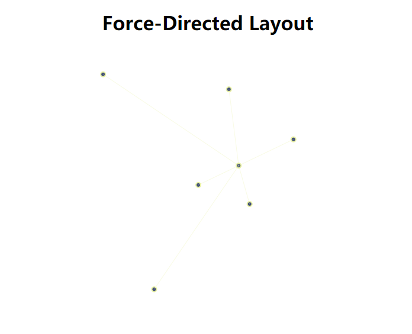

<html>
<script>
MathJax = {
  tex: {
    inlineMath: [['$', '$'], ['\\(', '\\)']]
  },
  svg: {
    fontCache: 'global'
  }
};
</script>

<script type="text/javascript" id="MathJax-script" async
  src="https://cdn.jsdelivr.net/npm/mathjax@3/es5/tex-svg.js">
</script>
</html>


# Force-Directed Layout
本次实验实现了力导向图布局（Force-Directed Layout)，考虑了3种加速优化策略，可视化图数据

## 实验环境
- windows10
- JavaScript
- d3.js
- chrome

## 测试数据
- [data-big: 共168个点，164条边](https://raw.githubusercontent.com/zih-an/scale-free_network/master/newLink.json)
- [data-samll: 共7个点，6条边](https://raw.githubusercontent.com/zih-an/SDU-visLabs2020/master/lab6/test_data.json)


## 可视化效果 
<div>
<div align="center" style="display:inline-block;">
    <div></div>
    <div><p>data-big</p></div>
</div>

<div align="center" style="display:inline-block;">
    <div></div>
    <div><p>data-small</p></div>
</div>
</div>


## 可视化思路
### 斥力(Fepulsive Force)的模拟
斥力使用库伦力，根据库伦定律模拟斥力:
$$
\begin{equation}\begin{split}
F=k*\frac{q_1q_2}{r^2}
\end{split}\end{equation} 
$$

### 引力(Spring Force)的模拟
引力使用弹力，根据胡克定律模拟引力
$$
\begin{equation}\begin{split}
F=k*\Delta{x}
\end{split}\end{equation} 
$$

### 位置的更新
根据在x和y方向上的分力，给定`delta_t`，更新`dx`和`dy`


### 加速策略
- 使用多级引力代替斥力
    + 根据课堂PPT内容，使用不同的引力替换斥力，省略斥力的计算。即，第一层邻居引力原长为`L`，第二层为`2*L`，第三层为`3*L`...以此类推。此方案在没有太多条边的情况下，引力本身较少，计算量一定会远少于`O(n^2)`
- 在位置更新比较`displacementSquared`和`MAX_DIS_SQUARED`大小时，使用平方比较，之后再开方
- 根据现有论文资料，经过整理有GEM布局算法、KK布局算法、FR布局算法等。

本次实验给出使用多级引力代替斥力的实现，并给出与原算法的对比。


## 技术实现
### 算法伪代码
</img>

### 斥力(Fepulsive Force)的模拟实现
```javaScript
// repulsion between all pairs
function repulsion_all(nodes){
    for(var i=0; i<nodes.lenth-1; i++) {
        var node1 = nodes[i];
        for(var j=i+1; j<nodes.length; j++) {
            var node2 = nodes[j];
            var dx = node2.x - node1.x, 
                dy = node2.y - node1.y;
            if(Math.abs(dx) > epsilon || Math.abs(dy) > epsilon) {
                var disSquared =dx*dx + dy*dy;
                var dis = Math.sqrt(disSquared);
                // Coulomb's law
                var force = k_r / disSquared;
                var fx = force * dx/dis,
                    fy = force * dy/dis;
                // refresh forces
                node1.force_x -= fx;
                node1.force_y -= fy;
                node2.force_x += fx;
                node2.force_y += fy;
            }
            else {  // generate a small force to separate them
                var small_force = 0.01;
                node1.force_x -= small_force;
                node1.force_y -= small_force;
                node2.force_x += small_force;
                node2.force_y += small_force;
            }
        }
    }
}
```

### 引力(Spring Force)的模拟实现
```javaScript
// spring force between all pairs
function spring_all(nodes, edges) {
    for(var i=0; i<nodes.length; i++)  {
        var node1 = nodes[i];
        for(var j=0; j<edges[i].length; j++) {
            var node2 = nodes[edges[i][j]];
            if(i < edges[i][j]) {
                var dx = node2.x - node1.x, 
                    dy = node2.y - node1.y;
                if(Math.abs(dx) > epsilon || Math.abs(dy) > epsilon) {
                    var dis = Math.sqrt(dx*dx + dy*dy);
                    // Hooke's law
                    var force = k_s * (dis - L);
                    var fx = force * dx/dis,
                        fy = force * dy/dis;
                    // refresh forces
                    node1.force_x += fx;
                    node1.force_y += fy;
                    node2.force_x -= fx;
                    node2.force_y -= fy;
                }
            }
        }
    }
}
```

### 位置的更新实现
```javaScript
// update positions
function update(nodes) {
    for(var i=0; i<nodes.length; i++) {
        var node = nodes[i];
        var dx = delta_t * node.force_x,
            dy = delta_t * node.force_y;
        var displacementSquared = dx*dx + dy*dy;
        if(displacementSquared - MAX_DIS_SQUARED > epsilon) {
            var s = Math.sqrt(MAX_DIS_SQUARED / displacementSquared);
            dx *= s, dy *= s;
        }
        node.x += dx, node.y += dy;
    }
}
```

### 使用d3.js展示最终布局的实现
```javaScript
// output
function layout(nodes){
    var margin = {top: 10, right: 60, bottom: 20, left: 60};
    var svg = d3
        .select("#graph")
        .append("svg")
        .attr("width", SVG_WIDTH + margin.right + margin.left)
        .attr("height", SVG_HEIGHT + margin.top + margin.bottom)
        .append("g")
        .attr("transform", "translate(" + margin.left + ", " + margin.top + ")");

    // build scales
    var xmn = d3.min(nodes, function (d) { return d.x; }),
        xmx = d3.max(nodes, function (d) { return d.x; }),
        ymn = d3.min(nodes, function (d) { return d.y; }),
        ymx = d3.max(nodes, function (d) { return d.y; });
    var xAxis = d3.scaleLinear()
        .range([0, SVG_WIDTH])
        .domain( [xmn-Math.abs(xmn*0.1), xmx+Math.abs(xmx*0.1)] );
    var yAxis = d3.scaleLinear()
        .range([SVG_HEIGHT, 0])
        .domain( [ymn-Math.abs(ymn*0.1), ymx+Math.abs(ymx*0.1)] );
        

    // nodes
    svg.append("g")
        .selectAll("circle")
        .data(nodes).enter().append("circle")
        .attr("stroke", "#e8f0a3")
        .attr("stroke-width", 2)
        .attr("fill", "#414f78")
        .attr("r", 4)
        .attr("cx", d => xAxis(d.x))
        .attr("cy", d => yAxis(d.y));
    
    // edges
    var edges_pos = [];
    for(var i=0; i<data.links.length; i++) {
        var  edge = {
            x1: nodes[data.links[i].target].x,
            y1: nodes[data.links[i].target].y,
            x2: nodes[data.links[i].source].x,
            y2: nodes[data.links[i].source].y,
        };
        edges_pos.push(edge);
    }

    svg.append("g")
        .selectAll("line")
        .data(edges_pos).enter().append("line")
        .attr("stroke", "#e8f0a3")
        .attr("stroke-width", 0.3)
        .attr("x1", function(d){
            return xAxis(d.x1);
        })
        .attr("y1", function(d){
            return yAxis(d.y1);
        })
        .attr("x2", function(d){
            return xAxis(d.x2);
        })
        .attr("y2", function(d){
            return yAxis(d.y2);
        });
}
```

### 使用多级引力代替斥力加速策略的实现
```javaScript
// spring forces L, 2L, 3L, ... among all paris
function spring_multi(nodes, edges) {
    for(var i=0; i<nodes.length; i++) {
        // visited array
        var vis = [];
        for(var row=0; row<nodes.length; row++)
            vis.push(0);
        vis[i] = 1;
        // preparation
        var node1 = nodes[i];
        var layer = 1;
        var neighbors = edges[i];  // init neighbors

        // layer L neighbors
        while(neighbors.length>0) {
            var nbLen = neighbors.length;
            for(var j=0; j<nbLen; j++) {
                // get 
                var nb = neighbors.shift();  // get the head and delete 
                vis[nb] = 1;  // visited
                var node2 = nodes[nb];
                // handle with node2
                if(i < nb) {
                    var dx = node2.x - node1.x, 
                        dy = node2.y - node1.y;
                    if(Math.abs(dx) > epsilon || Math.abs(dy) > epsilon) {
                        var dis = Math.sqrt(dx*dx + dy*dy);
                        // Hooke's law
                        var force = k_s * (dis - layer * L);  // original distance: layer * L
                        var fx = force * dx/dis,
                            fy = force * dy/dis;
                        // refresh forces
                        node1.force_x += fx;
                        node1.force_y += fy;
                        node2.force_x -= fx;
                        node2.force_y -= fy;
                    }
                }
                // update neighbors
                edges[nb].forEach(function(d) { if(!vis[d]) neighbors.push(d); });
            }
            layer++;
        }
    }
}
```
#### 使用data-big迭代10次对比图
易发现仅使用引力在这种情况下，速度明显加快，但是最终布局效果呈现出一个环状，表现并不是太好猜测是因为超参数值的设置导致的
<div>
<div align="center" style="display:inline-block;">
    <div><p>未加速</p></div>
    <div></div>
</div>

<div align="center" style="display:inline-block;">
    <div><p>加速</p></div>
    <div></div>
</div>
</div>


## 总结与思考
通过本次实验对力导向图布局的实现和加速优化，发现力导向图最终布局与初始化随机生成的坐标、各个超参数(hyper-parameters)有关，调节这些参数的大小对最终布局的效果有重要作用。当图中点、边很多时，布局达到稳定状态需要的计算次数明显增加，使用几个不同的加速策略，均能有效减少达到稳定布局状态的计算次数。此外，设计一个好的“收敛”标准也很有必要。

