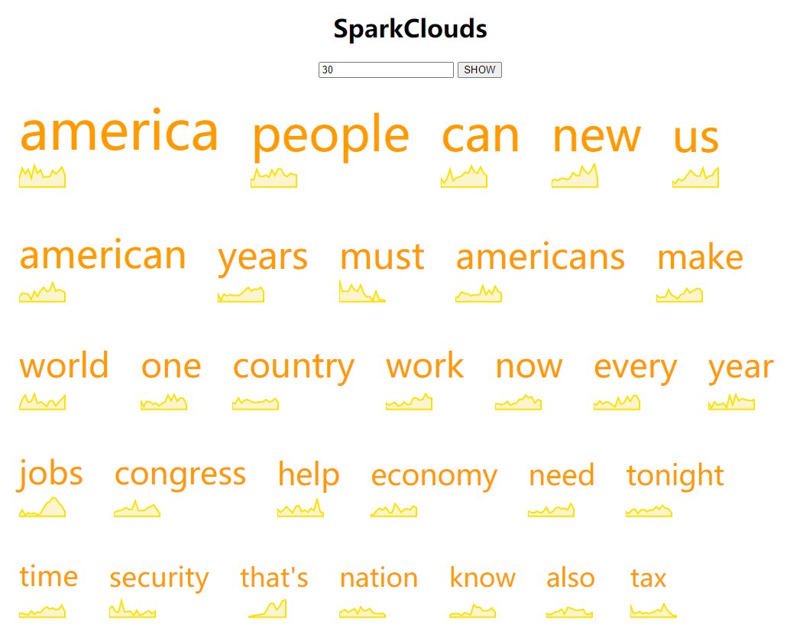

# Lab7 SparkClouds
本次实验实现了用SparkClouds可视化文本词频随时间的变化情况


## 可视化效果
可通过HTML的input输入期望的`top X`数量显示：




## 可视化思路
SparkClouds涉及两个方面，文字(大小)和sparklines，同时需要交互显示总频率最高的topX：
- 文字大小
    - 使用每个词在所有时间段内的频率总和作为标准
    - 使用每个词在某个用户选择时段的频率作为标准
    > 本实验中使用所有时段总和作为标准
- sparklines
    - X方向为时间段
    - Y方向为该时段出现的频率
    - 使用area形式展示，底部包含zero线
- topX的交互显示
    - 使用HTML的input元素
    - 使用button展示可视化结果


## 技术实现
### 交互展示
先清空相应`div`元素内容，在根据输入添加对应数目的`div`元素
```JavaScript
function prepareContainer() {
    document.getElementsByClassName("cloud")[0].innerHTML = "";
    let topNum = document.getElementById("topinput").value;
    let cloud = document.getElementsByClassName("cloud");
    for(let i=0; i<topNum; i++) {
        let num = document.createElement("div");
        num.setAttribute("style", `
            display: inline-block;
            margin: 20px 20px 20px 20px;
        `);
        // sub containers: text+line
        let text = document.createElement("div");
        text.setAttribute("class", "wordContainer");
        let line = document.createElement("div");
        line.setAttribute("class", "lineContainer");
        // append div
        num.appendChild(text);
        num.appendChild(line);
        cloud[0].appendChild(num);
    }
}
```

### 数据处理
使用d3聚集数据，统计数目
```JavaScript
// aggregate data
let nestData = d3.nest()
    .key(d => d.word)
    .entries(data);
for(let i=0; i<nestData.length; i++) {
    let tot = 0;
    for(let j=0; j<nestData[i].values.length; j++) {
        tot += Number(nestData[i].values[j].freq);
    }
    nestData[i].totfreq = tot;
}
nestData.sort(function(a,b){ return (b.totfreq - a.totfreq); });
```

### 文字显示
```JavaScript
// add text
let textScale = d3.scaleLinear()
    .range([10, 70]).nice()
    .domain(d3.extent(nestData, d => d.totfreq));
let texts = d3.select(".cloud").selectAll(".wordContainer")
    .data(nestData)
    .append("text")
    .text(d => d.key)
    .style("font-size", d => `${textScale(d.totfreq)}px`)
    .style("color", "#ff9a00");
```

### sparklines(area)展示
```JavaScript
// add sparklines
let lineWidth = 60,
    lineHeight = 30;
let xScale = d3.scaleLinear()
    .range([0, lineWidth])
    .domain([2001, 2016]);
let yScale = d3.scaleLinear()
    .range([0, lineHeight])
    .domain([d3.max(data, d => Number(d.freq)), d3.min(data, d => Number(d.freq))]);
    
let lineSvg = d3.select(".cloud").selectAll(".lineContainer")
    .append("svg")
    .attr("width", lineWidth+10)
    .attr("height", lineHeight+10)
    .data(nestData)
    .append("path")
    .datum(d => d.values)
    .attr("fill", "#faf5cf")
    .attr("stroke", "#ffe100")
    .attr("stroke-width", 2)
    .attr("d", d3.area()
        .x(function(d){ return xScale(Number(d.year)); })
        .y0(yScale(0))
        .y1(function(d){ return yScale(Number(d.freq)); })
    );
```

## 总结与思考
通过本次对SparkClouds的可视化，明白了SparkClouds的优缺点：
- 优点
    + 可以很好地比较不同词频的总体频率大小
    + 可以很好地观察各个词随时间的变化情况细节
    + 可以整张图静态展示词频趋势信息
- 缺点
    + 缺少显示时间的x轴
    + 不能看到具体的频率数值
    + 较长的单词比较小的单词更有吸引力
    + 每个单词在空间中的位置除按频率显示外没有意义

若想提高SparkClouds对频率细节的诠释，可以使用交互展示
